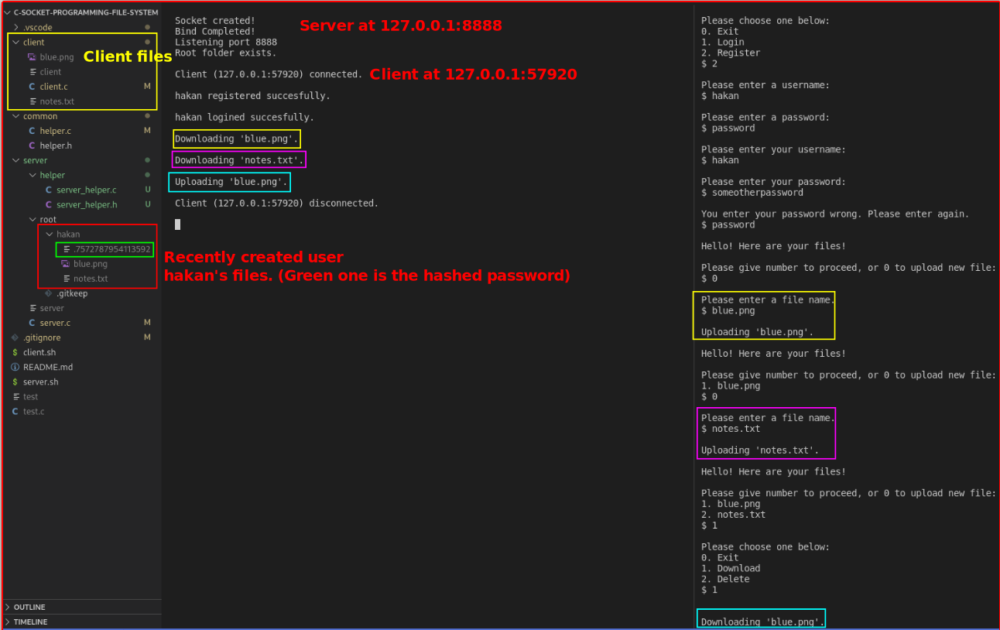
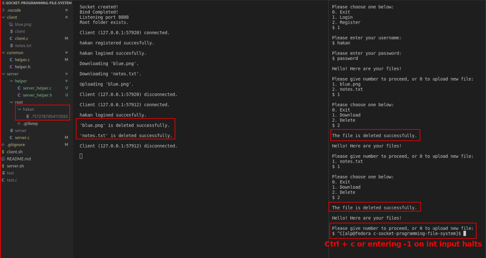

# c-socket-programming-file-system
File System using Sockets in C. Izmir Institute of Technology CENG421 Final project.

## Introduction:
Server has a root folder, and clients can achieve following operations:
- Login
- Register
- Download File
- Upload File
- Remove File

|||
| ------------- | ------------- |
| Every registered user has its own folder, and there is a password file created in order to achieve authenticity. (Green ones are generated password files, Red ones are the folders for users) Password is hashed from a function I found from the internet,and a new file created named “.hashed_pw” inside of the user's folder. So the whole file hierarchy looks like this.   | 

## Protocol:
I send the message in the following manner: “<type:6byte>-<Message>”.
There are following message types:
- INPUT0: Asks for int input from client
- INPUT1: Asks for string input from client
- INPUT2: Asks for file input from client
- INFO00: Sends information message, asks nothing from client.
- INFO01: Sends file, asks nothing back from client.
- ERROR0: Sends information about errors.

## How the code works:
  
You can run the server using “server.sh”, and client using “client.sh” from the root folder. You can use the account I created in the output screenshots which credentials are “hakan” and “password”. Or you can register new users freely.
Outputs:

  
## Bugs I could not solve:
I believe it is caused by TCP connection and kernel but, I could not manage to send 2 packages repeatedly. 50% of the times both send successfully, 50% of the times the second package does not send.
  
 ## License

This project is licensed under the mit license.\
See [license](/LICENSE) of this source code.
  
